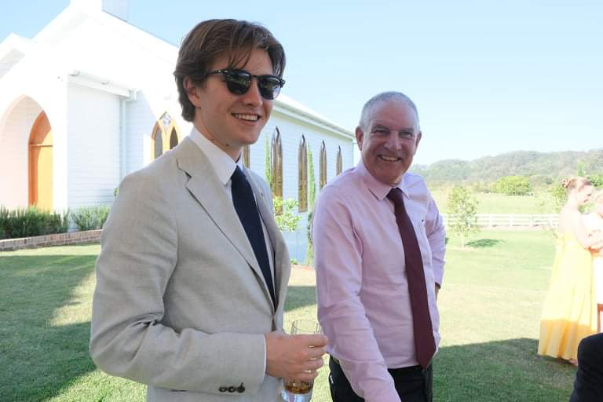

## HOME
Hi, my name is John and welcome to a blog about my life as an engineer. I've been on the path towards becoming an engineer since I was 15 years old (2014).
It started with my interests in nuclear energy and robotics. I excelled in mathematics, physics, and graphics, so I enrolled in the University of Queensland's Engineering Program. If you're interested in employeeing me, here's a link to my resume.

[My resume](images/John_Hanna_CV_2022_V3.pdf)

